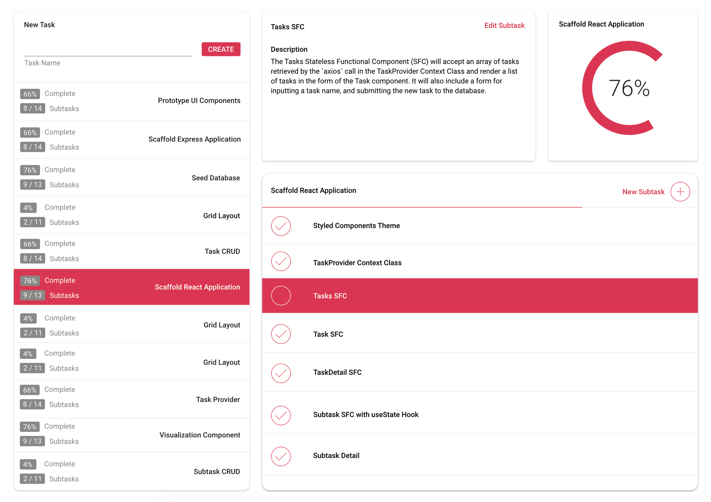

# Modern MERN

This module will cover:
- 🛡 Type-safe coding with TypeScript
- 💅 Building a flexible design system with `styled-components`
- 🔳 CSS Grid and Flexbox in action
- 🛣 Scalable Express Routing with Express' `Router` constructor
- 🕑 Preventing asynchronous spaghetti 🍝 with `async` / `await` and `Promise`s
- 🌳 React state management with the React Context API
- 📊 Data visualization with Nivo and custom solutions
- ⛩ Portals
- 👨‍👩‍👧 Real-world associations in Mongoose via `populate` and Mongoose hooks
- 🎣 Introduction to React Hooks
- 👩‍🔬 Real world application of the infamous Fibonacci interview problem

# What we're building: 

## Sprint
A sleek todo application allowing you to assign point value estimates to subtasks and visualize how far along you are in a project.



## Prerequisites
Make sure you have the following installed on your machine before you proceed:
- Node.js
- `create-react-app` (version 2 is required for scaffolding the React app with TypeScript config)
- `nodemon`
- MongoDB, `mongod`, and Robo 3T or Compass for visualizing data with MongoDB


# Code-along

## Project Scaffolding

We're starting completely from scratch here, so there is no starter code. Create a directory called whatever you'd like to call your personal take on the project.

**Command Line**
```
# initialize a new repo
git init

# create a root level .gitignore to ignore node_modules and auto-generated folders in version control
touch .gitignore

echo node_modules >> .gitignore
echo dist >> .gitignore
echo client/node_modules >> .gitignore
echo client/build >> .gitignore
echo .DS_Store >> .gitignore
```

Now for initializing our Node project. `-y` says 'yes' to all of npm's questions and builds your package.json immediately:
```
npm init -y
```
With npm all set, let's install TypeScript and the server-side dependencies we're going to use:

```
npm i --save-dev typescript tslint
```
While that's going, let's talk a bit about the elephant in the room.

#### Why TypeScript?


TypeScript is a superset of JavaScript, meaning that it can do everything JavaScript can do with the same syntax, but with numerous extras. It gives us many of the language conventions of other object oriented languages that JavaScript doesn't currently have, like enums, interfaces, and notably bringing ES7 modules to Node, and compiles them all down to JavaScript that the browser / V8 can understand. Yay, new stuff to make our development experience nicer, right?

Wrong--at least, initially. If you haven't worked with TypeScript and JavaScript was your first scripting language, TypeScript is going to be a royal pain to work with, because it introduces **static typing**, and in many cases removes the developer's reliance on the type inference that is so inherent in the JavaScript language. It forces you to think a bit deeper as you code, but in doing so, it eliminates potential bugs before you even finish writing the line of code at hand. Emotionally, when I was learning TypeScript, I felt personally attacked, and my productivity took a nosedive. I promise, though, that **the more experience you get with TS, you'll start to thank it for catching things you missed, you'll have more confidence that the code you write isn't going to break in production, and you ensure code integrity between the other collaborators on your team.**

#### Configure TypeScript for the Backend
At the root of your project (same level as the package.json), create a tsconfig.json and tslint.json, which will configure the TypeScript compiler and linter respectively.

**tslint.json**
```
{
    "defaultSeverity": "error",
    "extends": [
        "tslint:recommended"
    ],
    "jsRules": {},
    "rules": {
        "no-console": false
    },
    "rulesDirectory": []
}
```
The tslint.json is a lot like the eslint.json--it contains rules for your linter. Feel free to add more rules here as you begin to get comfortable with TS.

**tsconfig.json**
```
{
  "compilerOptions": {
    "module": "commonjs",
    "target": "es2015",
    "moduleResolution": "node",
    "sourceMap": true,
    "outDir": "dist"
  },
  "lib": ["es2015"],
  "exclude": ["client"]
}
```
This config is really important to get right, so I'd recommend copying and pasting directly into your project. The most important parts to note are the `"outDir"` property (the value we've provided tells TS to put the compiled JS into a dist folder at the same root level of our project), and the `"exclude"` array tells TS not to worry about compiling the client folder, whose own tsconfig will be configured by create-react-app.

Switch over to the package.json, because we're going to have some scripts and path configurations to add:

1) Overwrite the `"main"` value to `"dist/server.js"`, so that the file is pointed to the compiled JS as the entry point to the app.
2) Add the following scripts:

**package.json**
```
  "scripts": {
    "test": "echo \"Error: no test specified\" && exit 1",
    "prebuild": "tslint -c tslint.json -p tsconfig.json --fix",
    "build": "tsc",
    "prestart": "npm run build",
    "start": "node dist/server.js",
    "start:watch": "nodemon --inspect=5858 -r ts-node/register ./src/server.ts"
  },
```

What we're doing here is affording ourselves the beautiful `nodemon` experience of watching for changes to files upon running `npm run start:watch`. So, that's the command we're going to use from here on out to start our server-side. We've also afforded ourselves a little deployment "pipeline" that builds the TypeScript into JS that the V8 environment can understand and places it into a dist folder where our `"start"` script can find it.

3) Add the following `"nodemonConfig"`:

**package.json**
```
  "nodemonConfig": {
    "ignore": [
      "**/*.test.ts",
      "**/*.spec.ts",
      ".git",
      "node_modules",
      "client"
    ],
    "watch": [
      "src"
    ],
    "exec": "npm start",
    "ext": "ts"
  },
```
Most notably, this will tell `nodemon` to ignore changes to the file system if they're made to test files, if changes are committed with Git, or if modules are installed, and we certainly don't want our server to restart every time we make changes to our React application.

## Server Side Folder Structure
This was mentioned in passing before, but it's good to reiterate. Because TypeScript needs to compile to JavaScript to run in Node's V8 environment, we need to make sure that all of our server-side TypeScript goes inside a `src` folder. So, with that, our app will look like this:
```
client/
dist/
node_modules/

src
  |- api/
  |- config/
  |- controllers/
  |- environments/
  |- models/
  |- seeds/
  |_ server.ts

package.json
tsconfig.json
tslint.json
.gitignore
README.md
```
Go ahead and create all of this.

Inside of your src/server.ts (that's not a typo--yes, `.ts`), we're just going to get our feet wet with TypeScript with a simple `Greeting` class--we won't be using it in the actual application, so don't get too attached. Copy this code in there, and let's dissect it:

**src/server.ts**
```
class Greeting {

  name: string;

  constructor(name: string) {
    this.name = name;
  }

  public static printHello = (): void => console.log('Hello, TypeScript');
  
  public printPersonalizedGreeting = (): void => console.log(`Hello, ${this.name}`);
}

// invoke a stqtic method -- don't have to instantiate before calling (think Array.isArray() or Object.keys())
Greeting.printHello();

// instantiate a Greeting class and call its presonalized greeting method
const helloYourNameHere: Greeting = new Greeting('YourNameHere');
helloYourNameHere.printPersonalizedGreeting();
```

`private`, `public`, and `protected`? WTF is this, Java? I mean... it's way closer to Java than JavaScript was on its own. Notice the weird colons everywhere? That's how we specify the data type for each variable we declare. We can even set the return type on functions by putting a colon and a type after our parameter lists; oh, and look at the parameter list for the contructor! There's a type declaration in there too!

The first question you likely have is "Why do I care about the types? It's just extra... typing." 🤦‍  The answer will become apparent the more you use TypeScript. If the linter knows what type your variables and return types are, and you suddenly do something in your code that unexpectedly changes that variable type or doesn't return the expected value, the linter or a complete failure to compile will let you know. Congratulations, you just resolved a bug without even having to evaluate the behavior of the running application. The small wins really add up.

Okay. How do we actually run this? It's a `.ts` file and `node` doesn't know what the heck to do with it. The thing is, we need to compile the TS first in order to run it and the `ts-node` package is what will do that for us. We're going to have to run some one-off .ts seed files later on, so let's just install `ts-node` globally. You could opt for `npx` too, if you're not sure you're going to use TypeScript beyond this application.

**Command Line (from `src/`)**
```
# For you non-npx'ers, or if you're all in on TypeScript already:
npm i -g ts-node
ts-node server.ts

# For you npx'ers, or TypeScript skeptics:
npx ts-node server.ts
```

While we're at it, let's try running the script by using our npm script we added to the package.json. We're going to use that almost entirely to run our server side, so let's make sure that's good to go:

**Command line (from the root of the project)**
```
npm run start:watch
```

## Client Side Folder Structure
Inside the client folder you created, run the following. Notice the `.` at the end of the command instead of the app name you might be used to seeing--that'll place the root of the React application within this folder, instead of creating another folder to house itself. Also, be sure to use the `--typescript` flag.

**Command Line (from `client/`)**
```
# Non-npx'ers
create-react-app . --typescript

# npx'ers
npx create-react-app . --typescript
```

Once everything's installed and ready to go, you may notice some oddities, most notably, the `.tsx` extension. Unlike with plain JavaScript with JSX where .js and .jsx file extensions are interchangeable, **`.tsx` is not optional.** I mean... I'm not stopping you, but TSLint sure will.

Let's clean out all of the stuff we don't need. In this day and age, friends don't let friends write generic CSS, so tell those files to GTFOH. Similarly, kick the React logo svg to the curb. Let's also give ourselves a clean slate by removing all of the JSX from the `App.tsx` component (make sure to leave a set of divs or Fragments, so that `App` renders *something*).

Cool, that's about it for prepping our folder structure. Go ahead and run this with a simple `npm run start`, and we should just have a blank page. A clean slate.

## Express Routing

#### Server Listener
I like to start full-stack MERN applications with the Express part. Achieving network connectivity between the client and server is pretty fundamental to a full-stack app's functionality, so let's get crackin'.

Let's install some things:
```
npm i --save express mongoose body-parser
npm i --save-dev @types/express @types/mongoose
```

For those savvy amongst you, you're probably questioning the second set of dev-dependencies. There's an entire registry of types called DefinitelyTyped you can access from npm via `@types` for certain libraries like Mongoose and Express that allow you to explicitly type-annotate imports from those libraries--that way if you inadvertently do anything fishy with the exports those libraries are giving you, you can know about it right away. Once the types are installed, VS Code is pretty good about giving you options to select from, or you can use Google-foo.

In `src/server.ts`, delete the Greeting class we created, and let's set up a listener to wait for our requests. Like you're probably accustomed, we'll pass it an Express app, configured with `body-parser` middleware to accept JSON, as well as our main router, which we'll build after this. Let's also use a logger from the `morgan` package, so that we can debug incoming requests if necessary:

**src/server.ts**
```
import * as express from 'express';
import * as bodyParser from 'body-parser';
import * as logger from 'morgan';

const port: string = process.env.PORT || '3000';

const app: express.Application = express();

app.use(logger('combined'));
app.use(bodyParser.json())

app.listen(port, () => console.log(`Sprint API 🏃‍  on port ${port}`));
```

Whoaaaaa! ES7 imports in Node? No way. Yes, way. We've got some type annotations on the variables we're declaring here as well. "Why isn't `port` a number? I'm used to that being a number after the double pipe," you might say. Well, it definitely could be, but `process.env` variables are always read in as strings, so why not just make this variable consistently a string? If you're committed to a number an alternative is to specify that the type could be *either* a string *or* a number like so:
```
const port: (string | number) = process.env.PORT || 3000;
``` 
The entire goal with TS is to be less loosey-goosey with your types, so I'd steer away from **union types** like this as much as possible.

The `express.Application` type is a bit different too: that comes from the @types/express type package we installed. I found it by typing `:express.` and selecting from the VS Code type suggestions. Now, if we accidentally reassign `app` or something else weird, TypeScript is going to have something to say about it.

How do we test that this is working? We start it and ping it, of course!
**Command Line (from the project root)**
```
npm run start:watch
```
**Command Line (from another tab)**
```
curl localhost:3000
```
Run the `curl` command and check in the tab where you started your server process to see that `morgan` is logging at the very least, something.

It's *aliiiiiiiive!* Barely. But there's a pulse!

## The Data Layer

## Client / Server Network Connectivity

## The TaskContext - the brain of our client-side application

## Design System and Theme

## Our custom component library

## Layout

## 


